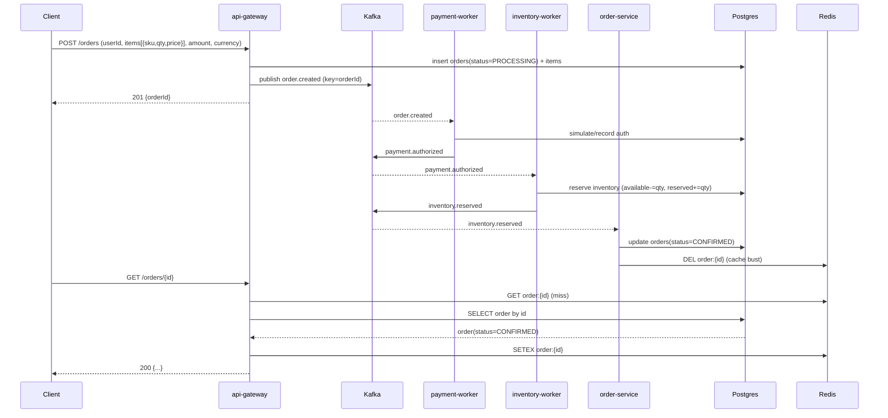

# OrderStream — Event-Driven Order Processing 
(Kafka + Node + Postgres + Redis)

A minimal, production-style backend that accepts orders over HTTP and completes payment + inventory asynchronously via Kafka. State is materialized in Postgres, hot reads flow through a Redis read-through cache, and the full path is traced with OpenTelemetry → Jaeger.


---

## Contents

* [Architecture](#architecture)
* [Data model](#data-model)
* [Events & topics](#events--topics)
* [Runtime components](#runtime-components)
* [How it works (end-to-end)](#how-it-works-end-to-end)
* [Run locally](#run-locally)
* [Load test (k6)](#load-test-k6)
* [Observability](#observability)
* [Kafka UI](#kafka-ui)
* [Make targets (optional)](#make-targets-optional)
* [Troubleshooting](#troubleshooting)

---

## Architecture

```mermaid
flowchart LR
  %% --- Groups ---
  subgraph Edge
    AG["api-gateway (Express)"]
  end

  subgraph Infra
    K["Kafka"]
    P["Postgres"]
    R["Redis"]
    J["Jaeger"]
  end

  subgraph Workers
    PW["payment-worker"]
    IW["inventory-worker"]
    OS["order-service"]
  end

  %% --- Flows ---
  C((Client)) -->|POST/GET| AG

  AG -->|order.created (key=orderId)| K
  K --> PW
  PW -->|payment.authorized / payment.failed| K
  K --> IW
  IW -->|inventory.reserved / inventory.failed| K
  K --> OS

  AG <-->|read-through| R
  R <--> P
  PW --> P
  IW --> P
  OS --> P

  %% --- Tracing (dotted edges) ---
  AG -.->|OTLP/HTTP| J
  PW -.->|OTLP/HTTP| J
  IW -.->|OTLP/HTTP| J
  OS -.->|OTLP/HTTP| J
```

### Sequence (happy path)



---

## Data model

**Postgres tables (minimum):**

```sql
-- orders: materialized order state
CREATE TABLE IF NOT EXISTS orders (
  id TEXT PRIMARY KEY,
  user_id TEXT NOT NULL,
  amount NUMERIC NOT NULL,
  currency TEXT NOT NULL,
  status TEXT NOT NULL,                    -- PROCESSING | PAID | CONFIRMED | FAILED
  failure_reason TEXT,
  created_at TIMESTAMPTZ NOT NULL DEFAULT now(),
  updated_at TIMESTAMPTZ NOT NULL DEFAULT now()
);

-- order line items
CREATE TABLE IF NOT EXISTS order_items (
  order_id TEXT REFERENCES orders(id) ON DELETE CASCADE,
  sku TEXT NOT NULL,
  qty INT NOT NULL,
  price NUMERIC NOT NULL,
  PRIMARY KEY (order_id, sku)
);

-- inventory accounting
CREATE TABLE IF NOT EXISTS inventory (
  sku TEXT PRIMARY KEY,
  available INT NOT NULL DEFAULT 0,
  reserved  INT NOT NULL DEFAULT 0
);
```

**Redis:**

* Key: `order:{id}` → serialized order JSON
* TTL \~ 60–120s; invalidate on `order.updated.v1`

---

## Events & topics

* `order.created.v1` (key = `orderId`)
* `payment.authorized.v1` / `payment.failed.v1`
* `inventory.reserved.v1` / `inventory.failed.v1`
* `order.updated.v1` (emitted by materializer)

**Event envelope (logical):**

```json
{
  "type": "inventory.reserved",
  "version": 1,
  "id": "event-uuid",
  "occurredAt": "RFC3339",
  "correlationId": "orderId",
  "payload": { "...domain fields..." }
}
```

All topics are keyed by `orderId` to guarantee per-order ordering across partitions. Consumers are idempotent: updates are guarded upserts, so duplicate deliveries are safe.

---

## Runtime components

* **api-gateway (Node/Express)**

  * `POST /orders` validates, persists initial row (`status=PROCESSING`), publishes `order.created.v1`, returns `201 {orderId}`
  * `GET /orders/{id}` uses Redis read-through cache with Postgres fallback

* **payment-worker**

  * Consumes `order.created.v1`, simulates authorization (config via `PAYMENT_SUCCESS_RATE`, `PAYMENT_THROW_RATE`), emits `payment.authorized.v1` or `payment.failed.v1`

* **inventory-worker**

  * Consumes `payment.authorized.v1`, atomically reserves stock in Postgres, emits `inventory.reserved.v1` or `inventory.failed.v1`

* **order-service (materializer)**

  * Consumes payment/inventory results, applies FSM transitions to `orders`, emits `order.updated.v1`, invalidates Redis key

* **Infra**

  * Kafka + Zookeeper (Bitnami), Postgres 15, Redis 7
  * Jaeger all-in-one (UI on `:16686`, **OTLP/HTTP** enabled)

* **Observability**

  * OpenTelemetry NodeSDK in each service, instrumentations: `http`, `express`, `pg`, `redis` (and kafkajs if present)
  * Exporter: `OTEL_EXPORTER_OTLP_ENDPOINT=http://jaeger:4318` (W3C trace context propagated through events)

---

## How it works (end-to-end)

1. Client submits an order to `POST /orders`. The gateway writes the initial state and publishes `order.created.v1` to Kafka (keyed by `orderId`).
2. `payment-worker` authorizes; on success emits `payment.authorized.v1`.
3. `inventory-worker` reserves stock; on success emits `inventory.reserved.v1`.
4. `order-service` materializes final state (`CONFIRMED`/`FAILED`) in Postgres and busts the Redis cache.
5. `GET /orders/{id}` returns **202 PROCESSING** during the saga, then **200** once the state settles.

The log (Kafka) provides at-least-once delivery; idempotent handlers and per-key ordering ensure correctness.

---

## Run locally

### Prerequisites

* Docker + Docker Compose
* (Optional) `k6` CLI for load testing

### 1) Clone

```bash
git clone <this-repo> order-system
cd order-system
```

### 2) Start services

```bash
docker compose up -d   # kafka, zookeeper, postgres, redis, jaeger, and all app services
```

> Ensure Jaeger exposes OTLP: the `jaeger` service should set `COLLECTOR_OTLP_ENABLED=true` (already configured).

### 3) Seed inventory (first run only)

Either mount `db/init_inventory.sql` (runs on fresh DB) or execute once:

```bash
docker exec -i order-system-postgres-1 psql -U app -d orders <<'SQL'
CREATE TABLE IF NOT EXISTS inventory (
  sku TEXT PRIMARY KEY,
  available INT NOT NULL DEFAULT 0,
  reserved  INT NOT NULL DEFAULT 0
);
INSERT INTO inventory (sku, available, reserved)
VALUES ('SKU-1', 100, 0)
ON CONFLICT (sku) DO UPDATE SET available = EXCLUDED.available;
SQL
```

### 4) Sanity check

```bash
# Create an order
curl -s -X POST http://localhost:3000/orders \
  -H 'content-type: application/json' \
  -d '{"userId":"u-1","items":[{"sku":"SKU-1","qty":1,"price":129.0}],
       "amount":129.0,"currency":"USD"}'

# Read it back
curl -s http://localhost:3000/orders/<orderId>
```

---

## Load test (k6)

`k6/orderstream.js` is parameterized to fit this API:

* `BASE_URL` (default `http://localhost:3000`)
* `ORDER_PATH` (default `/orders`)
* `ID_FIELD` (use `orderId`)

Run:

```bash
# Quick smoke
k6 run k6/orderstream.js --vus 5 --duration 30s \
  --env BASE_URL=http://localhost:3000 --env ORDER_PATH=/orders --env ID_FIELD=orderId

# Full profile (ramping-arrival 5→40 it/s for ~3m30s)
k6 run k6/orderstream.js \
  --env BASE_URL=http://localhost:3000 --env ORDER_PATH=/orders --env ID_FIELD=orderId
```

> Expected locally: low error rate, p95 in the tens of milliseconds (hardware dependent).

---

## Observability

* Jaeger UI: [http://localhost:16686](http://localhost:16686)
  Choose `api-gateway`, `payment-worker`, `inventory-worker`, `order-service` after generating a request.
* Services export directly to Jaeger’s OTLP HTTP:

  ```
  OTEL_EXPORTER_OTLP_ENDPOINT=http://jaeger:4318
  OTEL_SERVICE_NAME=<service-name>
  ```
* Useful span attributes: `order.id`, `event.type`, `kafka.topic`.

---

## Kafka UI

* Kafka UI (Provectus): [http://localhost:8080](http://localhost:8080)
  Inspect topics:

  * `order.created.v1`
  * `payment.authorized.v1`, `payment.failed.v1`
  * `inventory.reserved.v1`, `inventory.failed.v1`
  * `order.updated.v1`

---

## Make targets (optional)

If you prefer `make`, add this snippet:

```make
BASE_URL ?= http://localhost:3000
ORDER_PATH ?= /orders
ID_FIELD ?= orderId

k6:
	k6 run k6/orderstream.js --env BASE_URL=$(BASE_URL) --env ORDER_PATH=$(ORDER_PATH) --env ID_FIELD=$(ID_FIELD)

k6-quick:
	k6 run k6/orderstream.js --vus 5 --duration 30s --env BASE_URL=$(BASE_URL) --env ORDER_PATH=$(ORDER_PATH) --env ID_FIELD=$(ID_FIELD)

ob-up:
	docker compose up -d jaeger

down:
	docker compose down
```

---

## Troubleshooting

* **All k6 requests fail fast**
  Ensure you’re using `BASE_URL=http://localhost:3000` (8080 is Kafka-UI, not the API).

* **POST 400 (validation)**
  Include `price` in each line item.

* **GET returns 202**
  The saga is still running; poll again or check worker logs.

* **No services in Jaeger dropdown**
  Verify env: `OTEL_EXPORTER_OTLP_ENDPOINT=http://jaeger:4318`. Inside containers, **don’t** use `localhost`.

* **Inventory failures**
  Seed `inventory` table as shown above.

---

